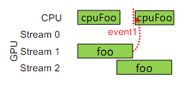
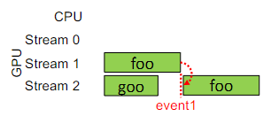
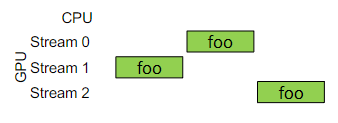

# Question 1 
Explain why NVIDIA GPUs do not classically provide any hardware support for grid-level synchronization. 

## Response
A grid-level synchronization would require HW mechanism among different SM that have not been added in order to maintain a simplier architecture and obtain higher performances.

# Question 2 
Write the formula for computing the arithmetic intensity of a kernel and apply it to the following function. 

``` 
#define STRUCT_DIM 3 
 
__global__ void foo(float *input, float *output){ 
  const int i = blockIdx.x*blockDim.x + threadIdx.x; 
  const float a = input[i*STRUCT_DIM]; 
  const float b = input[i*STRUCT_DIM+1]; 
  const float c = input[i*STRUCT_DIM+3]; 
  output[i] = (b-a)/c + (c-b)/(a+b); 
}
```

## Response
Arithmetic intensity of a kernal is given by the ratio between the floating points operations and the number of bytes transferred with memory instructions:

Floating points ops: 6
Bytes transferred: 4 (sizeof of float) * 4 (3 float data read from memory, and 1 float data wrote on memory)
Therefore the arithmetic intensity is 6/16 = 0,375


# Question 3 
Draw the Gantt chart of the execution of the various functions in the following three cases. 
 
(a) Assume that foo execution is longer than cpuFoo one. 
```
cudaStreamCreate(&stream1);  
cudaStreamCreate(&stream2);  
foo<<<blocks, threads, 0, stream1>>>();  
cudaEventRecord(event1, stream1); 
cpuFoo(); 
foo<<<blocks, threads, 0, stream2>>>();  
cudaEventSynchronize(event1); 
cpuFoo(); 
```
 
(b) Assume that foo execution is longer than goo one. 
```
cudaStreamCreate(&stream1);  
cudaStreamCreate(&stream2);  
foo<<<blocks, threads, 0, stream1>>>();  
cudaEventRecord(event1, stream1); 
goo<<<blocks, threads, 0, stream2>>>();  
cudaStreamWaitEvent(stream2, event1); 
foo<<<blocks, threads, 0, stream2>>>();  
 ```
 
 
(c) 
```
cudaStreamCreate(&stream1);  
cudaStreamCreate(&stream2);  
foo<<<blocks, threads, 0, stream1>>>();  
foo<<<blocks, threads>>>();  
foo<<<blocks, threads, 0, stream2>>>();
```

## Response




# Question 4 
Let’s assume to run the following kernel on a Maxwell (or more recent) architecture and to size the grid with a single 
block  of  32  threads;  which  is  the  efficiency  of  global  load  and  store  operations  of  the  following  CUDA  kernel? 
Motivate the answer. 

```
__global__ void foo(char* a, char* b){ 
  int i = blockIdx.x * blockDim.x + threadIdx.x; 
  b[(i+3)% blockDim.x] = a[(i*2)%blockDim.x];  
} 
```

## Response
From the load point of view we are using as index in order to access array "a" (thread_global_id*2)%32 which will give as result that the first 16 threads (with index from 0 to 15), will access to the even indexes of array "a" from 0 to 30, the other 16 threads will access the same even indexes of array "a" of the first 16 threads, therefore the efficiency is 50%.

From the store point of view we use as index (thread_global_id+3)%32, meaning that the first 29 threads (with index from  0 to 28) will access the indexes from 3 to 31, and the last 3 threads the indexes 0, 1 and 2. But therefore the efficiency is 100%

# Question 5 
Explain why OpenCL mainly adopts the just-in-time (JIT) compilation for the kernels to execute and which is the 
main exception where the JIT approach cannot be used.

## Response
The just in time compilation is perfomed in order to obtain an higher flexibility and transparency w.r.t the different heterogeneous systems that can be used as device unit, which will execute the kernel. In particular JIT compilation enables the runtime discovery of the underlying architecture where the code is being executed. In cannot be used in the case the device unit is an FPGA accelerator because they have not a fixed architecture that can be discovered so easily.

