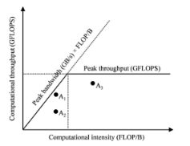

# Question 1 
Briefly explain what the graphics pipeline is. 

## Response
The graphic pipeline is a model that the describes the various steps needed in order to perform a 3D rendering task. It's usually composed by 4 "stages": Vertex, Primitive, Fragment and pixel. Each one is composed by 2 steps except of the pixel stage, and these steps are:
1) Vertex -> Vertex generation, Vertex processing
2) Primitive -> Primitive generation, Primitive processing
3) Fragment -> Fragment generation (also called rasterization), Fragment processing
4) Pixel -> Pixel operations


# Question 2 
Complete  the  following  OpenACC  pragmas  to  optimize  data  transfer  between  the  host  and  the  device.  In 
particular, 1) specify between brackets () the appropriate list of arrays (index range for each array is always 
[0:N]), and 2) delete unnecessary clauses. Motivate your answer. 
 
```
void foo(int *A, int *B){ 
  int C[N]; 
#pragma acc data copy(     ) copyin(     ) copyout(     ) create(     )   
{ 
  #pragma acc parallel loop copy(    ) copyin(    ) copyout(    ) create(    ) 
  for(int i = 0; i < N; i++) 
    C[i] = A[i] + B[i]; 
  #pragma acc parallel loop copy(    ) copyin(    ) copyout(    ) create(    ) 
  for(int i = 0; i < N; i++) 
    A[i] = C[i] * A[i]; 
} 
}
```

## Response
<pre>
#pragma acc data copy(A[0:N]) <s>copyin()</s> <s>copyout()</s> create(C[0:N])  
{ 
  #pragma acc parallel loop <s>copy()</s> copyin(B[0:N]) <s>copyout()</s> <s>create()</s>
  for(int i = 0; i < N; i++) 
    C[i] = A[i] + B[i]; 
  #pragma acc parallel loop <s>copy()</s> <s>copyin()</s> <s>copyout()</s> <s>create()</s>
  for(int i = 0; i < N; i++) 
    A[i] = C[i] * A[i]; 
} 
</pre>

The array A is used as both input (in both loops) and output array (in the last loop)
therefore its data must be copied from host to device for the input and to host from device for the output, therefore we can use the first copy clauses.
Then we need to allocate space in the device mem. for the C array.
After that for the B array we need to copy its values from the host to device in the first loop through the copyin clause.


# Question 3 
Simulate the following parallel reduction kernel (based on the algorithm optimizing memory access efficiency) 
and show the  data array’s content at each loop iteration.  Consider a grid with 2 blocks, each block with  4 
threads; the initial content of the data array is: [0, 1, 2, 3, 0, 1, 2, 3, 0, 1, 2, 3, 0, 1, 2, 3] 

``` 
#define STRIDE_FACTOR 2 
 
__global__ void reduce(double* data) { 
  int i = threadIdx.x; 
   
  int base_i = blockDim.x * blockIdx.x * STRIDE_FACTOR; 
  for (int stride = blockDim.x; stride >= 1; stride /= STRIDE_FACTOR) { 
    if (i < stride) { 
      data[base_i + i] += data[base_i + i + stride]; 
    } 
    __syncthreads(); 
  } 
}
```

## Response
|Iter.      |     data array content|
|-----------|-----------------------|      
|           |  0  1  2  3  4  5  6  7  8  9 10 11 12 13  14 15|
|0          | [0, 1, 2, 3, 0, 1, 2, 3, 0, 1, 2, 3, 0, 1, 2, 3]|
|1          | [0, 2, 4, 6, 0, 1, 2, 3, 0, 2, 4, 6, 0, 1, 2, 3]|
|2          | [4, 8, 4, 6, 0, 1, 2, 3, 4, 8, 4, 6, 0, 1, 2, 3]|
|3          | [12, 8, 4, 6, 0, 1, 2, 3, 12, 8, 4, 6, 0, 1, 2, 3]|

# Question 4 
Draw a basic example of the roofline model. Then, add to the plot the following 3 points representing: 
A. A memory-bound application efficiently using resources 
B. A memory-bound application not efficiently using resources 
C. A compute-bound application efficiently using resources

## Response


A1: A memory bound application efficiently using the resources
A2: A memory bound application not efficiently using resources
A3: A compute-bound application efficiently using resources

# Question 5 
Briefly describe the CUDA memory model (organize the answer in a table); for each component, specify the 
name, which data is stored, type of access (read/write or read-only), and scope. 

## Response

|Name|Data stored|Type of access|Scope|
|----|-----------|--------------|-----|       
|Registers|Are used to store basic data types such as int, double,... when defined inside the kernel function|Read/Write access|Single thread|
|Local|Is mapped to the global mem. It's used to store large data defined inside a kernel function, such as arrays for instance|Read/Write access|Single thread|
|Global|Main memory of the device, can be used by the programmer to store data in a static way by using the \_\_device__ qualifier or in a dynamic way by using cudaMalloc(...) function|Read/Write access|Entire application|
|Shared|Usable by the programmer to store data reused by several threads in the same block. Data can be stored in a static way: through the \_\_shared__ qualifier or in a dynamic way by passing the size of memory to allocate as 3rd parameter of a kernel function call (after the number of threads per block)|Read/Write access|Single block|
|Constant|Used in order to store constant value accessed by threads|Device: Read-only access <br> Host:Read/Write access|Entire application|
|Texture|Used to store 2D vectors (aka textures) in a more efficient way|Device: Read-only access <br> Host: Read/Write access|Entire application|

